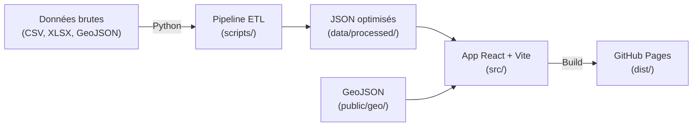

# Wasquehal Élections — Spec technique complète

Projet d'interface web interactive pour visualiser et analyser les données électorales et socio-démographiques de Wasquehal (code INSEE : **59646**), hébergée sur GitHub Pages.

---

## 1. Objectifs du projet

- Permettre l'exploration **par bureau de vote** (granularité la plus fine disponible)
- Centraliser **tous les résultats électoraux** de Wasquehal sur les 10 dernières années dans une interface unique
- Croiser les résultats avec le **profil socio-démographique** des quartiers (IRIS)
- Visualiser les **dynamiques** : évolution de l'abstention, bascules politiques, corrélations socio-vote
- Le tout sans backend, 100 % statique, hébergé gratuitement sur GitHub Pages

---

## 2. Sources de données

### 2.1 Résultats électoraux

| **Scrutin** | **Années** | **Source** | **Granularité** | **Format** |
| --- | --- | --- | --- | --- |
| Municipales | 2014, 2020, 2026 | [data.gouv.fr](http://data.gouv.fr) [— Municipales](https://www.data.gouv.fr/elections) | Bureau de vote | CSV / XLSX |
| Présidentielles | 2017, 2022 | [data.gouv.fr](http://data.gouv.fr) [— Élections agrégées](https://www.data.gouv.fr/datasets/donnees-des-elections-agregees) | Bureau de vote | CSV |
| Législatives | 2017, 2022, 2024 | [data.gouv.fr](http://data.gouv.fr) [— Élections agrégées](https://www.data.gouv.fr/datasets/donnees-des-elections-agregees) | Bureau de vote | CSV |
| Européennes | 2019, 2024 | [data.gouv.fr](http://data.gouv.fr) [— Élections agrégées](https://www.data.gouv.fr/datasets/donnees-des-elections-agregees) | Bureau de vote | CSV |
| Régionales | 2021 | [data.gouv.fr](http://data.gouv.fr) [— Élections agrégées](https://www.data.gouv.fr/datasets/donnees-des-elections-agregees) | Bureau de vote | CSV |
| Départementales | 2021 | [data.gouv.fr](http://data.gouv.fr) [— Élections agrégées](https://www.data.gouv.fr/datasets/donnees-des-elections-agregees) | Bureau de vote | CSV |

**Champs exploités par scrutin :**

- `code_commune`, `code_bureau_vote`
- `inscrits`, `votants`, `exprimes`, `abstentions`, `blancs`, `nuls`
- `nom_candidat` / `nom_liste`, `nuance`, `voix`, `pourcentage`
- `elu` (booléen, quand disponible)

### 2.2 Données socio-démographiques (INSEE)

| **Jeu de données** | **Source** | **Granularité** | **Indicateurs clés** |
| --- | --- | --- | --- |
| Recensement (dossier complet) | [insee.fr](http://insee.fr) | Commune + IRIS | Population, âge, sexe, nationalité, immigration |
| Revenus et pauvreté (Filosofi) | [insee.fr](http://insee.fr) | IRIS / carreau 200m | Revenu médian, taux de pauvreté, déciles |
| Emploi — Activité (RP) | [insee.fr](http://insee.fr) | IRIS | CSP, taux de chômage, taux d'activité |
| Diplômes — Formation (RP) | [insee.fr](http://insee.fr) | IRIS | Niveau de diplôme (sans diplôme → bac+5) |
| Logement (RP) | [insee.fr](http://insee.fr) | IRIS | Propriétaires vs locataires, logement social, ancienneté |

### 2.3 Données géographiques

| **Donnée** | **Source** | **Format** | **Usage** |
| --- | --- | --- | --- |
| Contours des bureaux de vote | [data.gouv.fr](http://data.gouv.fr) [— REU](https://www.data.gouv.fr/fr/datasets/bureaux-de-vote-et-டcontours-des-bureaux-de-vote/) | GeoJSON / Shapefile | Carte choroplèthe par BV |
| Contours IRIS | [IGN — IRIS GE](https://geoservices.ign.fr/contoursiris) | GeoJSON / Shapefile | Superposition données socio |
| Table de correspondance BV ↔ IRIS | [INSEE — table-appartenance-geo](https://www.insee.fr/fr/information/2028028) | CSV | Jointure résultats × profil socio |
| Contour communal | [IGN — Admin Express](https://geoservices.ign.fr/adminexpress) | GeoJSON | Cadre de la carte |

### 2.4 Point d'attention : jointure BV ↔ IRIS

<aside>
⚠️

Les découpages des bureaux de vote et des IRIS ne coïncident pas toujours. Deux approches possibles :

1. **Table de correspondance INSEE** — L'INSEE fournit depuis 2023 une table associant chaque adresse d'électeur à un bureau de vote et un IRIS. C'est la méthode la plus fiable.
2. **Intersection géométrique** — Calculer l'intersection spatiale entre les polygones BV et IRIS, puis pondérer les données socio au prorata de la population. Plus lourd mais plus flexible.

On privilégiera la méthode 1, avec la méthode 2 en fallback.

</aside>

---

## 3. Architecture technique

### 3.1 Vue d'ensemble



### 3.2 Stack détaillée

| **Couche** | **Techno** | **Version** | **Justification** |
| --- | --- | --- | --- |
| Bundler | Vite | 5.x | Build rapide, HMR, config minimale |
| Framework front | React 19 + TypeScript | 19.x | Écosystème riche, typage fort, composants réutilisables |
| Routing | React Router | 7.x | Navigation entre les vues (carte, évolution, profil…) |
| Cartographie | MapLibre GL JS + react-map-gl | 4.x / 7.x | Rendu vectoriel performant, open source (pas de clé API Mapbox) |
| Graphiques | Observable Plot (via @observablehq/plot) | 0.6.x | API déclarative, excellente pour l'exploration de données, léger |
| Graphiques alternatif | Recharts (si besoin d'interactivité poussée) | 2.x | Tooltips, animations, bien intégré React |
| UI / Design system | Tailwind CSS | 4.x | Utility-first, rapide à prototyper, léger en production |
| Pipeline données | Python 3.12 + pandas + geopandas | — | Nettoyage, jointures, exports JSON |
| CI/CD | GitHub Actions | — | Build + deploy auto sur push to main |
| Fond de carte | Tuiles OSM (ou Stadia Maps free tier) | — | Gratuit, pas de clé API nécessaire |

### 3.3 Structure du repo

```
wasquehal-elections/
├── .github/
│   └── workflows/
│       └── deploy.yml              # GitHub Actions : build Vite + deploy Pages
├── data/
│   ├── raw/                         # Fichiers bruts téléchargés
│   │   ├── elections/
│   │   │   ├── presidentielles_2022_bv.csv
│   │   │   ├── presidentielles_2017_bv.csv
│   │   │   ├── legislatives_2024_bv.csv
│   │   │   ├── legislatives_2022_bv.csv
│   │   │   ├── legislatives_2017_bv.csv
│   │   │   ├── europeennes_2024_bv.csv
│   │   │   ├── europeennes_2019_bv.csv
│   │   │   ├── regionales_2021_bv.csv
│   │   │   ├── departementales_2021_bv.csv
│   │   │   ├── municipales_2026_bv.csv
│   │   │   ├── municipales_2020_bv.csv
│   │   │   └── municipales_2014_bv.csv
│   │   ├── insee/
│   │   │   ├── base-ic-evol-struct-pop-IRIS.csv
│   │   │   ├── base-ic-diplomes-formation-IRIS.csv
│   │   │   ├── base-ic-activite-residents-IRIS.csv
│   │   │   ├── filosofi-revenus-IRIS.csv
│   │   │   └── base-ic-logement-IRIS.csv
│   │   └── geo/
│   │       ├── contours-bv-wasquehal.geojson
│   │       ├── contours-iris-wasquehal.geojson
│   │       └── correspondance-bv-iris.csv
│   └── processed/                   # JSON finaux pour le front
│       ├── elections.json           # Tous les scrutins, normalisés
│       ├── participation.json       # Séries temporelles abstention
│       ├── socio-iris.json          # Profils socio par IRIS
│       └── bv-iris-mapping.json     # Table de correspondance
├── scripts/
│   ├── requirements.txt
│   ├── 01_download.py               # Téléchargement automatisé des sources
│   ├── 02_filter_wasquehal.py       # Filtrage code INSEE 59646
│   ├── 03_normalize_elections.py    # Harmonisation des formats
│   ├── 04_build_socio.py            # Construction profil socio par IRIS
│   ├── 05_join_bv_iris.py           # Jointure BV ↔ IRIS
│   ├── 06_export_json.py            # Export JSON optimisés
│   └── 07_simplify_geo.py           # Simplification GeoJSON (mapshaper)
├── public/
│   └── geo/
│       ├── bv.geojson               # Contours BV simplifiés
│       └── iris.geojson             # Contours IRIS simplifiés
├── src/
│   ├── main.tsx
│   ├── App.tsx
│   ├── router.tsx
│   ├── components/
│   │   ├── layout/
│   │   │   ├── Header.tsx
│   │   │   ├── Sidebar.tsx
│   │   │   └── Footer.tsx
│   │   ├── map/
│   │   │   ├── ElectionMap.tsx       # Carte choroplèthe principale
│   │   │   ├── BureauPopup.tsx       # Popup au clic sur un BV
│   │   │   ├── LayerToggle.tsx       # Switch BV / IRIS / dual
│   │   │   └── Legend.tsx            # Légende dynamique
│   │   ├── charts/
│   │   │   ├── ParticipationChart.tsx # Courbes abstention
│   │   │   ├── ResultsBar.tsx        # Barres résultats par candidat
│   │   │   ├── PoliticalEvolution.tsx # Évolution par famille politique
│   │   │   ├── ScatterCorrelation.tsx # Nuage revenu × vote
│   │   │   └── CompareChart.tsx      # Comparaison 2 scrutins
│   │   ├── filters/
│   │   │   ├── ScrutinSelector.tsx    # Dropdown type + année
│   │   │   ├── TourSelector.tsx      # T1 / T2
│   │   │   └── MetricSelector.tsx    # Abstention, voix, %...
│   │   └── ui/
│   │       ├── Card.tsx
│   │       ├── Tooltip.tsx
│   │       └── Badge.tsx
│   ├── pages/
│   │   ├── MapView.tsx              # Vue carte interactive
│   │   ├── EvolutionView.tsx        # Vue évolution temporelle
│   │   ├── SocioView.tsx            # Vue profil socio-démographique
│   │   ├── CompareView.tsx          # Vue comparaison 2 scrutins
│   │   └── AboutView.tsx            # Méthodologie + sources
│   ├── hooks/
│   │   ├── useElectionData.ts       # Chargement + cache des JSON
│   │   ├── useSocioData.ts
│   │   └── useGeoData.ts
│   ├── utils/
│   │   ├── colors.ts                # Palettes par nuance politique
│   │   ├── aggregations.ts          # Fonctions de calcul (%, delta…)
│   │   └── types.ts                 # Interfaces TypeScript
│   └── data/
│       └── config.ts                # Métadonnées scrutins, labels
├── index.html
├── tailwind.config.ts
├── tsconfig.json
├── vite.config.ts
├── package.json
└── README.md
```

---

## 4. Pipeline de données (Python)

### 4.1 Étape 1 — Téléchargement (`01_download.py`)

Script qui télécharge automatiquement tous les fichiers bruts depuis les API [data.gouv.fr](http://data.gouv.fr) et INSEE. Utilise `requests` + les URLs stables des datasets. Stocke dans `data/raw/`.

### 4.2 Étape 2 — Filtrage Wasquehal (`02_filter_wasquehal.py`)

```python
# Pseudo-code
import pandas as pd

df = pd.read_csv("data/raw/elections/presidentielles_2022_bv.csv", sep=";")
df_wasquehal = df[df["code_commune"] == "59646"]
```

Attention : le code commune peut être stocké différemment selon les fichiers (`code_de_la_commune`, `Code commune`, `code_commune`). Le script doit gérer ces variations.

### 4.3 Étape 3 — Normalisation (`03_normalize_elections.py`)

Crée un schéma unifié pour tous les scrutins :

```tsx
// Schéma cible (TypeScript)
interface ElectionResult {
  scrutin: "presidentielle" | "legislative" | "municipale" | "europeenne" | "regionale" | "departementale";
  annee: number;
  tour: 1 | 2;
  bureau_vote: string;        // ex: "0001"
  inscrits: number;
  votants: number;
  abstentions: number;
  blancs: number;
  nuls: number;
  exprimes: number;
  candidats: {
    nom: string;
    prenom: string;
    nuance: string;           // ex: "REM", "LR", "RN", "LFI"...
    famille: string;          // ex: "gauche", "droite", "extreme_droite"...
    voix: number;
    pourcentage: number;      // % exprimés
    elu: boolean | null;
  }[];
}
```

**Table de mapping des nuances vers familles politiques :**

<aside>
📌

Les nuances politiques changent d'un scrutin à l'autre. Il faut construire une table de correspondance manuellement. Exemple partiel :

- `EXG`, `LFI`, `COM`, `FI`, `ECO`, `SOC`, `DVG`, `RDG`, `UG` → **gauche**
- `REM`, `ENS`, `MDM`, `DVC`, `UC` → **centre**
- `LR`, `DVD`, `UDI`, `UD` → **droite**
- `RN`, `REC`, `EXD` → **extrême droite**
- `DIV`, `REG`, `ABS` → **divers**

Cette table est un fichier de config (`scripts/nuances_mapping.json`) qu'on peut ajuster.

</aside>

### 4.4 Étape 4 — Profil socio (`04_build_socio.py`)

Fusionne les différentes bases INSEE (IRIS) pour Wasquehal. Produit un JSON avec, pour chaque IRIS :

```tsx
interface IrisSocio {
  code_iris: string;          // ex: "596460101"
  nom_iris: string;
  population: number;
  age_median: number;
  pct_moins_25: number;
  pct_plus_65: number;
  revenu_median: number;
  taux_pauvrete: number;
  pct_cadres: number;
  pct_ouvriers: number;
  pct_employes: number;
  pct_sans_diplome: number;
  pct_superieur: number;      // bac+2 et plus
  pct_proprietaires: number;
  pct_logement_social: number;
  taux_chomage: number;
}
```

### 4.5 Étape 5 — Jointure BV ↔ IRIS (`05_join_bv_iris.py`)

Utilise la table de correspondance INSEE pour associer chaque bureau de vote à un ou plusieurs IRIS (avec pondération par population si un BV chevauche plusieurs IRIS).

### 4.6 Étape 6 — Export JSON (`06_export_json.py`)

Génère les fichiers JSON finaux, optimisés pour le front :

- Suppression des colonnes inutiles
- Arrondi des flottants à 2 décimales
- Compression des clés (optionnel, pour réduire la taille)

### 4.7 Étape 7 — Simplification géo (`07_simplify_geo.py`)

Les GeoJSON bruts sont souvent trop lourds. On utilise `mapshaper` (via CLI) pour simplifier les géométries :

```bash
mapshaper contours-bv-wasquehal.geojson \
  -simplify dp 30% \
  -o format=geojson public/geo/bv.geojson
```

Objectif : des fichiers < 200 Ko pour un chargement rapide.

---

## 5. Fonctionnalités de l'interface

### 5.1 Vue Carte (`/carte`)

**Carte choroplèthe interactive de Wasquehal.**

- Fond de carte : tuiles OSM via [Stadia Maps](https://stadiamaps.com/) (gratuit jusqu'à 200k requêtes/mois) ou tuiles auto-hébergées
- Couche principale : polygones des bureaux de vote, colorés selon la métrique sélectionnée
- **Métriques disponibles :**
    - Taux d'abstention (gradient blanc → rouge foncé)
    - Candidat/liste arrivé en tête (couleur de la nuance politique)
    - Score d'un candidat spécifique (gradient de la couleur du parti)
    - Écart T1 → T2 (divergent bleu-rouge)
- **Interactions :**
    - Hover : highlight du BV + tooltip rapide (nom BV, score en tête, participation)
    - Clic : popup détaillé avec résultats complets + mini bar chart
    - Toggle de couche : superposer les contours IRIS (trait pointillé) pour croiser visuellement avec le socio
- **Contrôles :**
    - Sélecteur de scrutin (dropdown groupé par type)
    - Sélecteur de tour (T1 / T2)
    - Sélecteur de métrique

### 5.2 Vue Évolution (`/evolution`)

**Analyse des dynamiques temporelles.**

- **Graphique 1 — Abstention dans le temps**
    - Courbe : taux d'abstention par scrutin (tous types confondus), avec un point par élection
    - Ligne de référence : moyenne nationale (pointillé gris)
    - Tooltip : détail au survol
- **Graphique 2 — Évolution par famille politique**
    - Stacked area chart ou grouped bar chart
    - Axe X : scrutins chronologiques
    - Axe Y : % des suffrages exprimés par famille (gauche, centre, droite, extrême droite, divers)
    - Filtrable par type de scrutin
- **Graphique 3 — Volatilité par bureau de vote**
    - Heatmap : BV en lignes, scrutins en colonnes, couleur = famille politique en tête
    - Permet d'identifier les BV qui « basculent » fréquemment

### 5.3 Vue Profil socio-démographique (`/profil`)

**Radiographie socio de Wasquehal par quartier.**

- **Carte IRIS** colorée par indicateur socio (revenu, âge, diplôme, CSP…)
- **Radar chart** par IRIS : visualisation multi-dimensionnelle du profil
- **Scatter plot interactif** : corrélation entre un indicateur socio (axe X) et un résultat électoral (axe Y), chaque point = un BV/IRIS
    - Ex : revenu médian × score RN, ou taux de chômage × abstention
    - Droite de régression optionnelle
- **Tableau récapitulatif** : les IRIS de Wasquehal classés par indicateur, avec sparklines

### 5.4 Vue Comparaison (`/comparer`)

**Comparaison côte à côte de deux scrutins.**

- Deux cartes synchronisées (même zoom, même pan) affichant chacune un scrutin différent
- Sélecteurs indépendants pour chaque carte
- **Carte de différence** : une troisième carte montrant le delta entre les deux scrutins (évolution de la participation, progression d'un candidat, etc.)
- Tableau comparatif chiffré en dessous

### 5.5 Page Méthodologie (`/methodologie`)

- Sources de données avec liens
- Explication de la jointure BV ↔ IRIS
- Limites et biais connus
- Licence des données (Licence Ouverte Etalab 2.0)

---

## 6. Design et UX

### 6.1 Layout

```
┌──────────────────────────────────────────────┐
│  Header : titre + navigation (onglets)       │
├──────────────────────────────────────────────┤
│  Sidebar (filtres)  │  Zone principale       │
│  - Scrutin          │  - Carte ou graphiques │
│  - Tour             │                        │
│  - Métrique         │                        │
│  - BV sélectionné   │                        │
├──────────────────────────────────────────────┤
│  Footer : sources, méthodologie, GitHub      │
└──────────────────────────────────────────────┘
```

### 6.2 Palette de couleurs politiques

| **Famille** | **Couleur** | **Hex** |
| --- | --- | --- |
| Extrême gauche | 🟥 | `#BB1840` |
| Gauche | 🟥 | `#E4003A` |
| Écologiste | 🟩 | `#00A86B` |
| Centre | 🟨 | `#FFBF00` |
| Droite | 🟦 | `#0066CC` |
| Extrême droite | 🟦 | `#0D2C54` |
| Divers | ⬜ | `#999999` |

### 6.3 Responsive

- Desktop first (l'usage principal sera sur grand écran pour l'exploration)
- Mobile : la carte passe en plein écran, les filtres dans un drawer, les graphiques en scroll vertical

---

## 7. Performance

### 7.1 Budget taille

| **Ressource** | **Cible** |
| --- | --- |
| JS bundle (gzipped) | < 150 Ko |
| CSS (gzipped) | < 20 Ko |
| GeoJSON total | < 300 Ko |
| JSON données | < 500 Ko (tous scrutins) |
| First Contentful Paint | < 1.5s |

### 7.2 Stratégies

- **Lazy loading** des données JSON par scrutin (ne charger que ce qui est affiché)
- **Code splitting** par route (React.lazy + Suspense)
- **Simplification agressive** des GeoJSON (on est sur une seule commune, pas besoin de précision au mètre)
- **Pré-calcul** de toutes les agrégations côté Python (pas de calcul lourd côté client)

---

## 8. CI/CD — GitHub Actions

```yaml
# .github/workflows/deploy.yml
name: Deploy to GitHub Pages

on:
  push:
    branches: [main]

jobs:
  build-and-deploy:
    runs-on: ubuntu-latest
    steps:
      - uses: actions/checkout@v4
      - uses: actions/setup-node@v4
        with:
          node-version: 20
          cache: npm
      - run: npm ci
      - run: npm run build
      - uses: actions/upload-pages-artifact@v3
        with:
          path: dist
  deploy:
    needs: build-and-deploy
    runs-on: ubuntu-latest
    permissions:
      pages: write
      id-token: write
    environment:
      name: github-pages
    steps:
      - uses: actions/deploy-pages@v4
```

---

## 9. Roadmap de développement

### Phase 1 — Data pipeline *(~2-3 jours)*

- [x]  Téléchargement et stockage des sources brutes (Filtrées pour Wasquehal)
- [x]  Scripts de filtrage + normalisation (Script `03_normalize_elections.py`)
- [x]  Jointure BV ↔ IRIS (Script `05_join_bv_iris.py` calculant les intersections spatiales)
- [x]  Export JSON finaux (elections.json, participation.json, socio-iris.json, bv-iris-mapping.json)
- [x]  Simplification GeoJSON (Fichiers `bv.geojson` et `iris.geojson` générés dans `public/geo/`)

### Phase 2 — Squelette de l'app *(~1-2 jours)*

- [x]  Init Vite + React + TypeScript + Tailwind (Vite 6, React 19, Tailwind 4)
- [x]  Layout (Header avec 5 onglets, Sidebar, Layout 3 colonnes, routing React Router 7)
- [x]  Hooks de chargement des données (useElectionData, useGeoData, useParticipationData, useSocioData)
- [x]  Carte de base avec MapLibre (affichage des 9 BV)

### Phase 3 — Vue Carte *(~2-3 jours)*

- [x]  Coloration choroplèthe par métrique (abstention, famille en tête, score candidat)
- [x]  Popup au clic avec résultats détaillés (MapPopup avec barres participation + résultats)
- [x]  Sélecteurs de scrutin / tour / métrique (ScrutinSelector groupé + MetriqueSelector avec légende)
- [x]  Légende dynamique (intégrée au MetriqueSelector)

### Phase 4 — Vue Évolution *(~2 jours)*

- [x]  Graphique abstention temporelle (AbstentionChart via Recharts LineChart)
- [x]  Graphique évolution par famille politique (FamilleEvolutionChart, stacked AreaChart 100%)
- [x]  Heatmap de volatilité (BVHeatmap, grille BV × scrutin colorée par abstention)

### Phase 5 — Vue Profil socio *(~2-3 jours)*

- [x]  Tableau IRIS avec indicateurs socio (population, revenu, pauvreté, CSP…)
- [ ]  Scatter plot corrélation socio × vote (non implémenté)
- [x]  Radar chart par IRIS (SocioRadar, profil normalisé multi-dimensionnel)

### Phase 6 — Vue Comparaison *(~1-2 jours)*

- [x]  Double carte synchronisée (CompareView avec deux ElectionMap côte à côte)
- [ ]  Carte de différence (delta entre deux scrutins — non implémentée)
- [x]  Tableau comparatif (tableau chiffré avec deltas par BV)

### Phase 7 — Polish *(~1-2 jours)*

- [ ]  Responsive mobile (desktop only actuellement)
- [x]  Page méthodologie (AboutView avec sources, limites, licence)
- [x]  README (documentation.md)
- [x]  Deploy GitHub Pages (CI/CD GitHub Actions configuré, base path `/wasquehal-elections/`)

### Phase 8 — Finalisation *(audit qualité)*

#### Lot 1 — Pipeline données (P0)

- [x] Compléter le mapping des nuances politiques (117 codes couverts, dont codes candidats présidentiels, préfixes L- législatives, BC- binômes cantonaux)
- [x] Supprimer le dead code `parse_election()` (bug `annee` vs `year`, jamais appelée)
- [x] Normaliser les overlaps BV-IRIS à 100% (corrige les >100% dus aux imprécisions géométriques)
- [x] Remplacer les données socio mock (random.seed(42)) par les vraies données INSEE millésime 2021
- [x] Ajouter script `06_sync_to_public.py` : copie data/processed → public/data + split élections + régénération familles-evolution.json

#### Lot 2 — Frontend : déploiement GitHub Pages (P0)

- [x] Créer `assetUrl()` et préfixer tous les fetch avec `import.meta.env.BASE_URL`
- [x] Ajouter `basename` au `BrowserRouter`
- [x] Copier `index.html` → `404.html` dans le script build (SPA routing GitHub Pages)
- [x] Ajouter vérification `r.ok` dans `useGeoData`
- [x] Ajouter `.catch()` error handling dans `useFamillesData`

#### Lot 3 — Performance (P1)

- [x] Code splitting avec `React.lazy` + `Suspense` (MapLibre ne charge que sur /carte)
- [x] Retirer `@observablehq/plot` (jamais importé, ~50KB mort)

#### Lot 4 — UX (P1)

- [x] Conserver la métrique sélectionnée au changement de scrutin
- [x] Tri numérique des BV dans CompareView (au lieu d'alphabétique)
- [x] Documenter les limitations dans AboutView (BV 0016 créé en 2017, blancs avant 2014)
- [x] Afficher le nombre de BV et note historique dans la sidebar MapView

#### Lot 5 — Documentation pipeline (P2)

- [x] Créer `scripts/requirements.txt`
- [ ] Documenter l'ordre d'exécution dans le README

### Problèmes résolus

- ~~⚠️ **Données socio-démographiques en mock**~~ → Remplacées par données INSEE réelles (millésime 2021)
- ~~⚠️ **Mapping nuances incomplet (40/117)**~~ → 117/117 codes couverts, familles correctes sur tous les scrutins
- ~~⚠️ **Chemins fetch cassés sur GitHub Pages**~~ → `assetUrl()` + basename BrowserRouter
- ~~⚠️ **Bundle JS trop lourd**~~ → Code splitting React.lazy, suppression dep morte
- ⚠️ **49 scrutins au lieu de 12 prévus** : le pipeline a récupéré des données depuis 1999, dépassant la spec "10 dernières années" (conservé volontairement)

**Estimation totale : 11 à 17 jours** de développement effectif (en solo).

---

## 10. Extensions possibles (v2)

- **Données temps réel** les soirs d'élection (via l'API du Ministère de l'Intérieur)
- **Comparaison inter-communes** : ajouter les villes voisines (Croix, Villeneuve-d'Ascq, Marcq-en-Barœul…)
- **Projections / clustering** : regrouper les BV par profil sociologique similaire (k-means sur les variables socio)
- **Export** : permettre de télécharger les données filtrées en CSV
- **Embedding** : composants iframe intégrables dans un blog (pour tes articles éventuels)